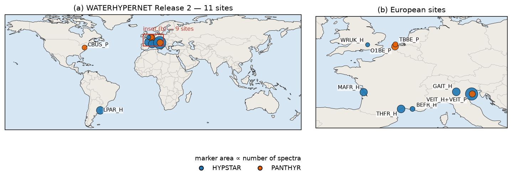
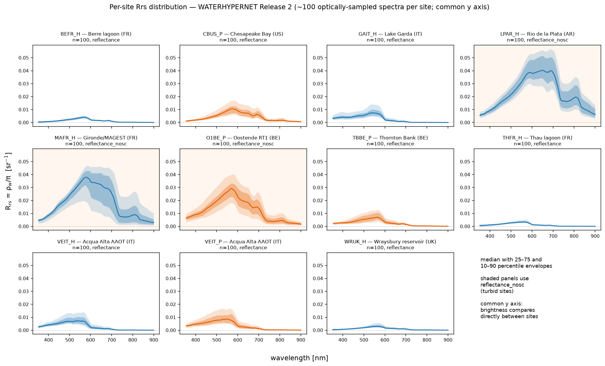
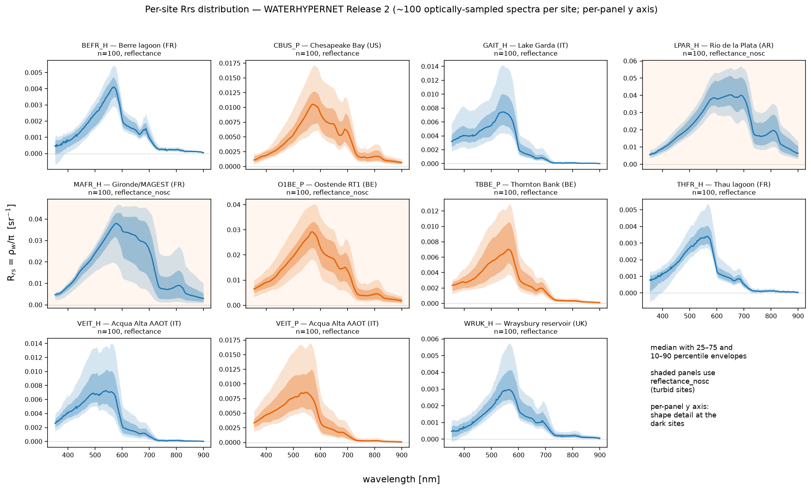
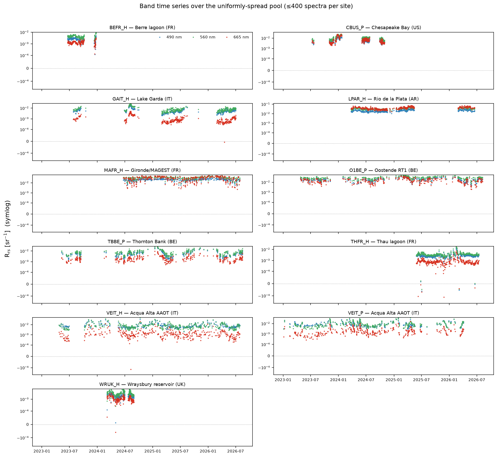

# Choosing your data

## The sites

| site | location | system | spectra | first | last | months | lat | lon | PI |
|---|---|---|---:|---|---|---:|---:|---:|---|
| BEFR_H | Berre lagoon, FR | HYPSTAR | 1,798 | 2023-06-19 | 2024-01-04 | 7 | 43.44231 | 5.09718 | D. Doxaran (LOV) |
| CBUS_P | Chesapeake Bay, US | PANTHYR | 1,950 | 2023-07-11 | 2024-12-23 | 7 | 39.12 | −76.35 | — |
| GAIT_H | Lake Garda, IT | HYPSTAR | 6,373 | 2023-07-27 | 2026-07-31 | 9 | 45.57700 | 10.57942 | V. Brando (CNR) |
| LPAR_H | Río de la Plata, AR | HYPSTAR | 5,987 | 2024-03-24 | 2026-07-31 | 12 | −34.81797 | −57.89595 | A. Dogliotti (CONICET) |
| MAFR_H | Gironde / MAGEST, FR | HYPSTAR | 5,614 | 2024-06-21 | 2026-07-31 | 12 | 45.54765 | −1.04050 | D. Doxaran (LOV) |
| O1BE_P | Oostende RT1, BE | PANTHYR | 4,607 | 2023-04-25 | 2026-09-09 | 12 | 51.25 | 2.92 | — |
| TBBE_P | Thornton Bank, BE | PANTHYR | 2,021 | 2023-05-11 | 2026-09-06 | 12 | 51.53 | 2.96 | — |
| THFR_H | Thau lagoon, FR | HYPSTAR | 6,260 | 2025-05-28 | 2026-07-29 | 12 | 43.43486 | 3.66416 | D. Doxaran (LOV) |
| VEIT_H | Acqua Alta AAOT, IT | HYPSTAR | 17,668 | 2023-04-24 | 2026-07-31 | 12 | 45.31420 | 12.50830 | V. Brando (CNR) |
| VEIT_P | Acqua Alta AAOT, IT | PANTHYR | 3,502 | 2023-01-04 | 2026-05-31 | 12 | 45.31 | 12.51 | — |
| WRUK_H | Wraysbury reservoir, UK | HYPSTAR | 889 | 2024-03-05 | 2024-09-15 | 7 | 51.45758 | −0.53219 | A. Bialek (NPL) |

The same table in machine-readable form: {download}`summary_table.csv <summary_table.csv>`,
which carries additional per-site columns (band counts, solar-zenith range,
median Rrs(560), blue–green ratio, relative σ, negative fraction).

HYPSTAR coordinates are fixed per-site attributes. PANTHYR files instead carry
per-file GPS averages that jitter at the ~1e-5° level, so the values above are
medians. The coordinate is the radiometer's position; the water target is 3–20 m
away. GAIT and WRUK coordinates were wrong in Release 1 and are corrected here.

## Coverage is very uneven

VEIT_H alone is 31% of the archive; WRUK_H is 1.6%. More importantly for anyone
designing a sampling scheme, **only 6 of the 11 sites span a full seasonal
cycle**: BEFR (2023-06 → 2024-01), WRUK (2024 only), CBUS (7 distinct months)
and GAIT (9 months) do not. Several sites have multi-month gaps mid-record.

## What the spectra look like

On a common y axis the range of the network is immediate: the Río de la Plata,
Gironde and Oostende are bright, while Berre, Thau, Wraysbury and — perhaps
surprisingly — Acqua Alta and Lake Garda are dark enough to be nearly flat at
this scale. Median Rrs(560) runs from 0.0030 sr⁻¹ at Wraysbury to 0.036 sr⁻¹ at
the Gironde, a factor of 12, and the blue–green ratio Rrs(490)/Rrs(560) from 0.52
(Berre) to 1.03 (Acqua Alta) — from strongly green/turbid to near-marine.

The same data with each panel autoscaled recovers the spectral shape at the dark
sites, which the common axis necessarily suppresses:

Clustering the L2-normalised 400–800 nm shapes across all sites (k=8) shows the
sites occupy genuinely different optical regimes rather than one continuum: LPAR
is almost entirely one cluster, CBUS and O1BE another, while VEIT and GAIT split
across several. Cluster 5 (n=9) is the group discussed in
[the over-subtraction issue](over-subtraction.md).

Seasonal cycles are visible at GAIT and VEIT; LPAR and MAFR are persistently
turbid with little seasonal structure.
